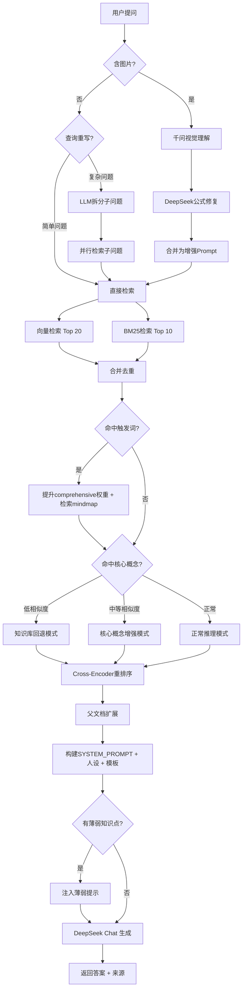

# 408考研专属知识库 — 全面进展总结与优化规划

> 审计日期: 2026-05-31 | 分支: main | 基于完整项目扫描
> **记录约定**：每次功能变更后同步更新本文档「核心功能清单」对应项 + 追加「更新日志」。入口：`PROJECT_REVIEW_AND_PLAN.md`

---

## 第一部分：项目进展总结

### 一、核心功能清单

| 序号 | 功能模块 | 功能点 | 完成度 | 说明 |
|------|----------|--------|--------|------|
| **资料导入** |
| 1 | 多格式加载 | PDF / Markdown / TXT 资料加载 | ✅ 已完成 | LangChain PyPDFLoader + TextLoader |
| 2 | 增量导入 | SHA256 缓存，仅处理新增/修改文件 | ✅ 已完成 | 按 source 分组增量更新 |
| 3 | 分类分块 | minds/ 按标题拆分、notes/ 保持 Q&A 完整、其他默认分块 | ✅ 已完成 | MarkdownHeaderTextSplitter + 自定义 Q&A 检测 |
| 4 | OCR 流水线 | 扫描版 PDF → Tesseract OCR → 文本导入 | ✅ 已完成 | 多进程/多线程加速，快速/质量双模式 |
| 5 | 元数据标记 | category / subject / type / doc_id / chunk_index | ✅ 已完成 | 支撑检索增强与父文档扩展 |
| 6 | Streamlit 上传 | Web 端直接上传文件并增量导入 | ✅ 已完成 | 但 `_do_ingest()` 有已知 bug（缺少 doc_id） |

| **检索层** |
| 7 | 向量检索 | BGE-small-zh-v1.5 本地嵌入 + 余弦相似度计算 | ✅ 已完成 | 真实余弦相似度，非 Chroma 映射分 |
| 8 | BM25 关键词检索 | jieba 中文分词 + rank_bm25 | ✅ 已完成 | 分批加载避开 SQLite 变量上限 |
| 9 | 混合检索合并 | 向量 + BM25 结果合并去重 | ✅ 已完成 | |
| 10 | Cross-Encoder 重排序 | ms-marco-MiniLM-L-6-v2 精排 | ✅ 已完成 | 自动回退到跳过重排序（不阻断） |
| 11 | 查询重写 | 复杂问题 LLM 拆分为最多 3 个子问题分别检索 | ✅ 已完成 | 可配置开关 |
| 12 | 父文档扩展 | 检索小块后向上查找相邻 chunk 拼接 | ✅ 已完成 | 依赖 doc_id/chunk_index 元数据 |
| 13 | 触发词增强 | 比较/异同等触发词 → 检索 mindmap + 提升 comprehensive 权重 | ✅ 已完成 | |
| 14 | 核心概念强制召回 | 命中 CORE_CONCEPTS 时追加关键词检索并加权 | ✅ 已完成 | 低相似度回退到 LLM 内置知识 |
| 15 | OCR 公式修复 | 千问视觉识别 → DeepSeek 修复公式乱码 | ✅ 已完成 | |

| **生成层** |
| 16 | CoT 推理链 | 「提取知识点 → 分析关联 → 综合回答」强制推理 | ✅ 已完成 | |
| 17 | 人设系统 | "高分学长·直击核心"风格，结构化表达 | ✅ 已完成 | 可配置名称/风格 |
| 18 | 专题深度总结模板 | 五段式结构（结论→背景→分析→易错点→口诀） | ✅ 已完成 | 触发词自动激活 |
| 19 | 分层可信度回答 | 高置信度（基于资料）/ 低置信度（回退 + 免责）/ 核心概念增强 | ✅ 已完成 | 三层策略 |
| 20 | 记忆力注入 | 薄弱知识点（评分≤2）自动提示 LLM 针对性讲解 | ✅ 已完成 | |
| 21 | 图片问答 | 千问 qwen3.6-plus 视觉理解 → 注入检索 | ✅ 已完成 | 单图/多图联合分析 |

| **考情分析** |
| 22 | 真题分类 | 40+ 关键词自动将混合真题分入四科 | ✅ 已完成 | |
| 23 | 趋势报告生成 | 四科 Top10 高频考点 + 近 3 年趋势 + 冷门提醒 | ✅ 已完成 | DeepSeek 生成 Markdown 报告 |
| 24 | 报告持久化 | report_2026.md 保存与下载 | ✅ 已完成 | |

| **前端交互 (Streamlit)** |
| 25 | 聊天界面 | 类 ChatGPT 对话式问答 | ✅ 已完成 | |
| 26 | 历史对话 | 会话持久化 + 多会话切换 | ✅ 已完成 | JSON 文件存储 |
| 27 | 对话导出 | 导出当前对话为 Markdown | ✅ 已完成 | |
| 28 | 图片上传问答 | 拖拽上传 → 视觉识别 → 自动问答 | ✅ 已完成 | 最多 3 张联合分析 |
| 29 | 追问上下文 | 图片描述缓存 5 轮追问 | ✅ 已完成 | |
| 30 | 错题本保存 | 图片问答结果一键保存到错题本目录 | ✅ 已完成 | 含增量导入 |
| 31 | 反馈评分 | 答对/答错按钮 → 更新掌握度 | ✅ 已完成 | |
| 32 | 侧边栏资料管理 | 分类上传 + 自动导入 | ✅ 已完成 | |
| **大题专练** |
| 33 | 大题专项练习 | `comprehensive_practice.py` 模块，模板+参数替换生成大题 | ✅ 已完成 | 已集成 Streamlit 侧边栏「📝 大题专练」 |
| 34 | PV操作：生产者-消费者 | 经典多生产者-多消费者 PV 信号量实现 | ✅ 已完成 | 信号量定义 + 伪代码 + 考点分析 |
| 35 | PV操作：读者-写者问题 | 读者优先 + 写者优先两种方案 | ✅ 已完成 (新增) | `read_count` 计数器 + 饥饿分析 |
| 36 | PV操作：哲学家进餐问题 | 三种防死锁方案（mutex/room/奇偶号） | ✅ 已完成 (新增) | 死锁四个必要条件讲解 |
| 37 | PV操作：吸烟者问题 | 三个吸烟者+一个供应者同步 | ✅ 已完成 (新增) | 多类产品信号量分配 |
| 38 | PV操作：理发师问题 | 理发师+多个顾客等待队列同步 | ✅ 已完成 (新增) | 资源信号量双向同步 |
| 39 | PV操作：水果盘问题（苹果橘子） | 两个生产者+两个消费者，多类资源同步 | ✅ 已完成 (新增) | 与标准生产者-消费者对比 |
| **前端交互 (React)** |
| 40 | RESTful API 服务化 | FastAPI 封装 11 个接口，统一 `/api` 前缀，CORS 支持 | ✅ 已完成 (新增) | `server.py` 全业务逻辑包装 |
| 41 | 聊天页面 | 消息列表 + Markdown 渲染 + 来源标签 + 思考动画 | ✅ 已完成 (新增) | 支持 Enter 发送 |
| 42 | 图片上传问答 | 📷 按钮选择图片 → 预览 → 发送 `/api/chat/image` | ✅ 已完成 (新增) | 视觉模型识别后回答 |
| 43 | 错题本一键保存 | 🤖 回答下方 📝 按钮 → 调用 `/api/mistake_book` | ✅ 已完成 (新增) | 保存问答对 |
| 44 | 练习页面 | 科目+题型双下拉筛选 / 生成 / 换一题 / 显隐答案 | ✅ 已完成 (新增) | 覆盖 25 类题型 |
| 45 | 数据管理页面 | 文件多选上传 + 导入结果展示 + 考情分析报告 | ✅ 已完成 (新增) | Markdown 渲染报告 |
| 46 | 导航路由 | React Router: `/chat` / `/practice` / `/data` / `/mistakes` / `/weakness` | ✅ 已完成 (新增) | 高亮当前页 |
| 47 | 浅色/深色模式 | CSS 变量体系，跟随系统偏好自动切换 | ✅ 已完成 (新增) | |
| **前端交互 (React) 新增** |
| 48 | 错题本独立页面 | 原错题本+薄弱点混合页拆分为两个独立功能区，在导航栏各占一个链接 | ✅ 已完成 (新增) | 用户选择将问题加入哪个区 |
| 49 | 薄弱点独立页面 | 独立展示薄弱点，含列表/筛选/统计/导出/同类题/概念卡片 | ✅ 已完成 (新增) | |
| 50 | 题目点击查看详情 | 在错题本/薄弱点列表中点击题目弹出详情弹窗(ItemDetail)，展示完整题目/答案/元数据 | ✅ 已完成 (新增) | 支持一键跳转同类题和概念卡片 |
| 51 | 同类题/概念卡片绑定具体题目 | 每条题目旁有🎯同类题和🃏概念卡片按钮，自动提取知识点生成 | ✅ 已完成 (新增) | 支持 Markdown 导出 |
| 52 | 历史对话侧边栏 | 聊天页面左侧历史会话面板，支持加载/查看/切换/删除历史会话 | ✅ 已完成 (新增) | 重新恢复丢失的历史对话功能 |
| 53 | 对话导出为Markdown | 当前对话一键导出为 Markdown 文件下载 | ✅ 已完成 (新增) | 恢复丢失的导出功能 |
| 54 | 追问功能 | AI 回答后显示💬追问和🎯出同类题按钮，基于上下文继续对话 | ✅ 已完成 (新增) | 支持普通追问和同类题生成 |
| 55 | 同类题在聊天中生成 | 聊天中「出同类题」按钮自动提取知识点，调用 API 生成并显示在对话中 | ✅ 已完成 (新增) | |
| **强化学习（新增）** |
| 56 | 强化学习独立页面 | 导航栏新增「🎯 强化」链接，独立页面含同类题/概念卡片/题库浏览三个选项卡 | ✅ 已完成 (新增) | 集成 SimilarQuestion + ConceptCards 组件 |
| 57 | 选择题题库预处理 | `/data/exercise` 4 个 PDF 已转为 .txt，同类题生成时作为参考素材而非照抄 | ✅ 已完成 (新增) | 题库可浏览/搜索/作为出题参考 |
| 58 | 同类题基于题库参考生成 | 同类题不再直接返回题库原题，而是提取知识点+题型结构，LLM 新编题目（修改题面/参数/选项） | ✅ 已完成 (新增) | 遵循「不照抄」规则 |
| 59 | 系统超时保护 | 对 /chat /mistake/similar /mistake/cards 等端点添加 120-180s 超时兜底，避免 LLM 卡死 | ✅ 已完成 (新增) | timeout_exec + LLM timeout 参数 |
| 60 | 同类题/概念卡片全屏加载遮罩 | 生成同类题/概念卡片时全屏遮罩阻止用户操作，含旋转加载动画和提示 | ✅ 已完成 (新增) | MistakePage + WeaknessPage |
| 61 | 真题分类资料作为出题最高优先级参考 | `/data/exercise/exam/` 4 个真题分类 .txt 作为最高优先级出题参考 | ✅ 已完成 (新增) | _load_exercise_questions() 递归扫描子目录 + is_exam 标记 |

---

### 二、技术架构图（前后端分离）

```
┌───────────────────────────────────────────────────────────────────────────┐
│                            用户交互层                                      │
│  ┌──────────────┐   ┌──────────────────────┐   ┌──────────────────────┐  │
│  │  CLI (main.py)│   │  React 前端 (Vite)   │   │  Streamlit (向后兼容) │ │
│  │  ingest/ask/  │   │  ChatPage / Practice │   │  app.py (保留)       │ │
│  │  analyze      │   │  DataPage / NavBar   │   │                      │ │
│  └──────┬───────┘   └──────┬───────────┬────┘   └──────────────────────┘  │
└─────────┼──────────────────┼───────────┼─────────────────────────────────┘
          │                  │           │
          │           Vite Proxy (:5173)  │
          │           /api → :8000        │
          ▼                  ▼           ▼
┌───────────────────────────────────────────────────────────────────────────┐
│                        API 服务层 (server.py / FastAPI)                    │
│                                                                           │
│  ┌──────┐ ┌──────────┐ ┌──────────┐ ┌──────────┐ ┌──────┐ ┌─────────┐   │
│  │ /chat│ │ /chat/   │ │ /practice│ │ /ingest  │ │ /analyze│ │ /mistake│  │
│  │      │ │ image    │ │ /calcula-│ │          │ │         │ │ _book   │  │
│  │      │ │          │ │ tion &   │ │          │ │         │ │         │  │
│  │      │ │          │ │ compreh. │ │          │ │         │ │         │  │
│  └──┬───┘ └────┬─────┘ └────┬─────┘ └────┬─────┘ └────┬────┘ └────┬────┘  │
│     │          │            │            │           │           │       │
└─────┼──────────┼────────────┼────────────┼───────────┼───────────┼───────┘
      │          │            │            │           │           │
      ▼          ▼            ▼            ▼           ▼           ▼
┌───────────────────────────────────────────────────────────────────────────┐
│                             业务逻辑层                                     │
│                                                                           │
│  ┌──────────┐  ┌──────────┐  ┌──────────┐  ┌──────────┐ ┌────────────┐  │
│  │ ingest.py│  │  qa.py   │  │analysis.py│ │memory.py │ │vision.py   │  │
│  │ 分块策略 │  │ 混合检索 │  │ 考情分析  │ │ 掌握度   │ │ 千问视觉   │  │
│  │ 增量导入 │  │ 重排序   │  │ 四科分类  │ │ 追踪反馈 │ │ 公式修复   │  │
│  │ 元数据   │  │ 查询重写 │  │ 报告生成  │ │          │ │            │  │
│  └────┬─────┘  └────┬─────┘  └────┬─────┘  └────┬─────┘ └─────┬──────┘  │
│  ┌────┴─────┐  ┌────┴─────┐      │             │             │         │
│  │ calcula- │  │ compre-  │      │             │             │         │
│  │ tion_    │  │ hensive_ │      │             │             │         │
│  │ practice │  │ practice │      │             │             │         │
│  └──────────┘  └──────────┘      │             │             │         │
│       │             │            │             │             │         │
└───────┼─────────────┼────────────┼─────────────┼─────────────┼─────────┘
        │             │            │             │             │
        ▼             ▼            ▼             ▼             ▼
┌───────────────────────────────────────────────────────────────────────────┐
│                             基础设施层                                     │
│                                                                           │
│  ┌──────────────────┐  ┌──────────────────┐  ┌─────────────────────────┐ │
│  │ ChromaDB         │  │ LLM API          │  │ 视觉模型                │ │
│  │ (向量存储/检索)  │  │ DeepSeek Chat    │  │ Qwen3.6-Plus            │ │
│  │ collection:      │  │ via openai SDK   │  │ via DashScope           │ │
│  │ 408_knowledge    │  │                  │  │                         │ │
│  └────────┬─────────┘  └────────┬─────────┘  └───────────┬─────────────┘ │
│           │                     │                        │               │
│  ┌────────┴─────────┐  ┌───────┴──────────┐  ┌──────────┴──────────┐   │
│  │ BGE-small-zh-v1.5 │  │ Cross-Encoder    │  │ OCR Pipeline         │   │
│  │ 本地 Embedding    │  │ ms-marco-MiniLM  │  │ Tesseract+PyMuPDF   │   │
│  │ (CPU推理)         │  │ (重排序, CPU)    │  │                     │   │
│  └──────────────────┘  └──────────────────┘  └─────────────────────┘   │
└───────────────────────────────────────────────────────────────────────────┘
```

**数据流（问答路径）：**



---

### 三、关键配置与依赖

| 层级 | 组件 | 选型 | 版本/配置 |
|------|------|------|-----------|
| **LLM** | 问答模型 | DeepSeek Chat (API) | `deepseek-chat`, temp=0 |
| **LLM** | 视觉模型 | 千问 Qwen3.6-Plus | via DashScope (`VISION_MODEL`) |
| **Embedding** | 文本嵌入 | BGE-small-zh-v1.5 | 本地 CPU, 512维, ModelScope 下载 |
| **Reranker** | 重排序 | cross-encoder/ms-marco-MiniLM-L-6-v2 | 本地 CPU, ModelScope/HF 双源下载 |
| **向量库** | 存储与检索 | ChromaDB | `chromadb>=0.5.0`, SQLite 持久化 |
| **分词** | BM25 中文分词 | jieba | `>=0.42.1` |
| **OCR** | 扫描版PDF | Tesseract + PyMuPDF | Windows Tesseract + 中文语言包 |
| **框架** | 文档处理 | LangChain | `>=0.3.0` |
| **框架** | LLM 调用 | openai SDK | `>=1.0.0` (兼容 DeepSeek/DashScope) |
| **前端** | Web UI | React (Vite) + FastAPI | `frontend/` 独立目录，API 通过 `/api` 路由 |
| **分块** | 通用 | 256 chars / 64 overlap | `CHUNK_SIZE` / `CHUNK_OVERLAP` |
| **分块** | 思维导图 | 1500 chars | `MINDMAP_CHUNK_SIZE` |
| **分块** | 大题资料 | 2000 chars | `COMPREHENSIVE_CHUNK_SIZE` |
| **检索** | 混合检索 | 向量 Top 20 + BM25 Top 10 → 重排 Top 10 | |

**资料分布（截至 2026-05-31）：**

| 分类 | 目录 | 文件数 | 说明 |
|------|------|--------|------|
| 考试大纲 | `data/outline/` | 1 PDF | 图片型，OCR 已处理 |
| 教材 | `data/textbooks/` | 10+ PDF | 王道+竟成，四科全覆盖 |
| 历年真题 | `data/exams/` | 23 PDF | 2009-2026，含考点分类系列 |
| 笔记 | `data/notes/` | 14+ PDF | 含专题总结和押题资料 |
| 思维导图 | `data/minds/` | 4 PDF | 四科含新大纲考点导图 |
| 错题本 | `data/exams/错题本/` | 运行中积累 | 图片 + 题目描述 .md |
| 向量库 | `data_output/chroma_db/` | ~2,900+ 块 | 持续增量更新 |

---

### 四、已优化的亮点

1. **分类分块策略**：minds/ 按 Markdown 标题拆分保持结构，notes/ Q&A 保持完整题目-答案对，textbooks/exams 精细分块，三类策略各得其用。

2. **混合检索 + 重排序**：向量语义召回 (Top 20) + BM25 关键词召回 (Top 10) → Cross-Encoder 精排 (Top 10)，兼顾语义泛化与关键词精准。

3. **三层可信度响应**：
   - 高置信度：严格基于参考资料回答
   - 核心概念增强：资料部分相关时强制 LLM 综合回答（不允许拒绝）
   - 知识库回退：资料完全无关但属于核心考点时，使用 LLM 内置知识 + 免责标注

4. **查询重写**：复杂问题自动拆分为 3 个子问题独立检索，避免单一检索遗漏相关上下文。

5. **父文档扩展**：检索小块后自动查找同一文档的相邻 chunk（前后各 2 块），拼接为完整段落，避免上下文碎片化。

6. **核心概念强制召回机制**：预定义 40+ 核心概念关键词映射表，命中时自动追加关键词检索、对匹配文档加权、并启用回退/增强模式，确保基础概念不被漏检。

7. **CORE_CONCEPTS 字典**：针对四科常见考点构建了详细的关键词扩展表（约 150+ 关键词），覆盖指令周期、Cache、虚拟内存、中断、DMA、流水线、排序、树、图、TCP、HTTP 等核心考点。

8. **OCR 全流程**：扫描版 PDF → Tesseract OCR（支持快速/质量模式、多进程并行）→ 自动生成 .txt → ingest.py 无缝导入。

9. **图片问答闭环**：千问视觉识别 → DeepSeek 公式修复 → 注入检索上下文 → 回答 + 一键保存错题本（图片+描述+增量入库）。

10. **追问上下文缓存**：图片描述在用户端缓存，支持 5 轮追问内复用识别结果，无需重复调用视觉模型。

11. **记忆力模块**：基于反馈的知识点掌握度评分（1-5 分），薄弱知识点自动注入系统提示，引导 LLM 针对性强化讲解。

12. **专题深度总结模板**：9 个触发词自动激活五段式结构化回答（核心结论→知识背景→分点分析→易错点→记忆口诀）。

---

## 第二部分：后续优化方向与路线图

### 一、功能完善类（现有功能打磨）

| 序号 | 问题 | 现状 | 建议 |
|------|------|------|------|
| F1 | ~~**BUG: app.py `_do_ingest()` 缺少元数据**~~ | ✅ 已修复 (2026-05-31)：提取 `build_chunks()` 和 `write_chunks_to_vectorstore()` 公共函数，`_do_ingest()` 复用 ingest.py 逻辑，确保 doc_id/chunk_index 完整 | ✅ 已完成 |
| F2 | **代码清理：死代码与未使用导入** | qa.py k 参数、analysis.py Counter/Path、app.py sys 等 4 处冗余 | 🟡 顺手清理 |
| F3 | ~~**ingest/app 代码重复**~~ | ✅ 已重构 (2026-05-31)：提取 `build_chunks()` 和 `write_chunks_to_vectorstore()` 到 ingest.py，CLI 和 Streamlit 复用同一逻辑 | ✅ 已完成 |
| F4 | **测试脚本碎片化** | test_qa.py / run_qa_test.py / _test_questions.py 等 5+ 测试脚本 | 合并为统一测试模块 |
| F5 | **错误处理不统一** | catch Exception → pass 的回退模式散布多处 | 引入 warning 日志而非静默跳过 |
| F6 | **无性能监控** | 检索耗时、LLM 延迟、ChromaDB 查询性能无记录 | 添加关键路径计时日志 |
| F7 | **Streamlit 前端细节** | 无加载进度条细分、无流式输出、无 Markdown 渲染优化 | 增加 streaming、优化 UX |
| F8 | **Embedding 模型固定** | bge-small 精度有限，无升级路径 | 支持配置切换 bge-base/bge-large |
| F9 | **无单元测试** | 0 个单元测试 | 为核心模块（retrieve、分块、QA 检测）添加 pytest |
| F10 | **配置验证缺失** | 环境变量缺失时运行时崩溃 | 启动时集中校验所有必需配置 |
| F11 | **对话框组件无键盘快捷键** | Streamlit 体验受限 | 添加 Enter 发送、Ctrl+N 新对话等 |
| F12 | **向量库无备份机制** | ChromaDB 单点，误删无法恢复 | 增加定期备份脚本或导出工具 |

---

### 二、能力提升类（408 备考场景新功能）

| 序号 | 功能 | 描述 | 优先级 | 预估工作量 |
|------|------|------|--------|-----------|
| **N1** | ~~**计算题+大题专项练习 (已覆盖)**~~ | ✅ 已实现：`calculation_practice.py`（8类计算题型）+ `comprehensive_practice.py`（12类→17类大题题型，含6道PV操作），均采用模板+参数替换方式，已集成 Streamlit 侧边栏 | ✅ 已完成 |
| **N2** | **错题智能推送** | 基于 memory.py 的掌握度评分，间隔重复推送薄弱知识点的相关真题（参考 Anki SM-2 算法） | 🔴 高 | 3-5 天 |
| **N3** | **模拟组卷** | 按考纲比例（DS 45分/CO 45分/OS 35分/CN 25分）从真题/错题/薄弱点中自动组卷，支持限时模拟 | 🔴 高 | 5-7 天 |
| **N4** | **背诵卡片生成** | 将检索到的核心概念（如 LRU 替换、TCP 三次握手、PV 操作、死锁必要条件等）自动转换为 Q&A 卡片，可使用 Markdown/Anki 格式导出 | 🟡 中 | 3-5 天 |
| **N5** | **每日一题推送** | 随机选中薄弱科目的真题，每天推送一道选择题 + 一道大题（含解析），支持 Streamlit / 命令行 / 邮件提醒 | 🟡 中 | 2-3 天 |
| **N6** | **知识图谱可视化** | 基于 CORE_CONCEPTS 词典和真题分类，构建四科知识点的依赖关系图谱（D3.js / ECharts），可视化考点关联与掌握度 | 🟡 中 | 5-7 天 |
| **N7** | **真题计时练习** | 选择题/大题倒计时模式，统计答题速度与正确率，生成个人能力画像 | 🟢 低 | 3-5 天 |
| **N8** | **章节刷题报告** | 按考纲章节统计正确率、薄弱章节、建议复习优先级 | 🟡 中 | 2-3 天 |
| **N9** | **公式速查** | 从资料中自动提取并整理常见公式（时间复杂度、Cache 映射、浮点数 IEEE 754、OS 调度算法等），提供结构化速查表 | 🟢 低 | 1-2 天 |
| **N10** | **多轮对话** | 支持上下文连续对话，记住上一轮的问题领域，支持在之前回答上追问（当前 Streamlit 已缓存图片上下文，可扩展为通用上下文） | 🟡 中 | 2-3 天 |
| **N11** | **语音输入** | 支持语音提问（Whisper API 或浏览器 Web Speech API），特别适合移动端碎片化学习 | 🟢 低 | 1-2 天 |
| **N12** | **PDF 批注导出** | 将问答结果导出为带高亮的 PDF/Markdown 笔记，方便打印复习 | 🟢 低 | 2-3 天 |

---

### 三、架构升级类（长远演进方向）

| 序号 | 问题 | 瓶颈分析 | 建议方案 | 优先级 |
|------|------|----------|----------|--------|
| **A1** | **向量数据库升级** | ChromaDB 基于 SQLite，2900+ 块已触发 "too many SQL variables" 问题（已分批 workaround）；检索效率随规模线性下降 | 迁移到 Milvus Lite（嵌入式如 ChromaDB）或 Qdrant，支持 HNSW 索引、更好的过滤性能 | 🟡 中 |
| **A2** | **异步任务队列** | 资料导入（特别是 OCR 大型 PDF）和考情分析报告生成是耗时操作，当前在请求线程中同步执行，阻塞 UI | 引入 Celery/Redis 或轻量级的 background task（FastAPI BackgroundTasks），Streamlit 端用轮询/WebSocket 显示进度 | 🟡 中 |
| ~~**A3**~~ | ~~**API 服务化**~~ | ~~当前 qa.py 仅 CLI 和 Streamlit 直接调用，无标准 REST API~~ | ✅ 已完成 (2026-06-01)：`server.py` FastAPI 封装 11 个 RESTful 接口，统一 `/api` 前缀 | ✅ 已完成 |
| ~~**A4**~~ | ~~**真正的 React 前端**~~ | ~~Streamlit 适合快速原型，但在 UI 定制、性能、移动端体验方面受限~~ | ✅ 已完成 (2026-06-01)：Vite + React 19 前端，含聊天/练习/数据管理三页面，CSS 变量双主题 | ✅ 已完成 |
| **A5** | **数据与分析解耦** | 当前分析完全依赖 LLM 实时生成，不可复现、结果不稳定 | 引入结构化统计模块（Python 直接统计考点频次），LLM 只负责趋势解读，减少幻读风险 | 🟡 中 |
| **A6** | **多模态 RAG** | 当前图片文件仅通过 OCR 后的文本入库，原始图片/图表信息丢失 | ColPali/ColQwen 等视觉-语言检索模型，直接对 PDF 页面图像做向量化，保留图表公式信息 | 🟢 低 |
| **A7** | **用户系统** | 无登录/多用户隔离，记忆力模块为全局 JSON | 引入用户认证、个人资料目录、云端同步 | 🟢 低 |
| **A8** | **CI/CD 与容器化** | 无 Docker 配置、无 CI 流水线 | Dockerfile + Docker Compose 一键部署，GitHub Actions 自动测试 | 🟡 中 |

---

### 四、行动路线图

#### 🟢 近期（1-2 周）— 稳定基础、修复已知问题

| 编号 | 任务 | 类型 | 预估时间 | 备注 |
|------|------|------|----------|------|
| P0-1 | ~~**修复 BUG-1: app.py `_do_ingest()` 缺少 doc_id/chunk_index**~~ | ✅ 已完成 | — | 2026-05-31 完成 |
| P0-2 | ~~清理死代码：移除 qa.py k 参数、analysis.py 未使用导入、app.py sys 导入~~ | ✅ 已清理 | 0.5h | 零风险 |
| P0-3 | ~~提取 ingest 公共函数：合并 ingest.py main() 与 app.py _do_ingest() 的重复逻辑~~ | ✅ 已完成 | — | 2026-05-31 完成，含 N1 集成 |
| P0-4 | 合并测试脚本：统一 test_qa.py / run_qa_test.py / _test_questions.py | 🟡 整理 | 1h | |
| P0-5 | 添加启动配置检查：config.py 中 `validate_config()` 函数，运行时早期报错 | 🟡 完善 | 1h | API_KEY 等 |
| P0-6 | ~~清理临时文件：根目录下 `_*.py`、`_*.txt`、`_*.log` 等 ~20 个临时文件~~ | ✅ 已清理 | 0.5h | gitignore + 删除 |
| P0-7 | 添加检索/LLM 调用计时日志 | 🟢 功能 | 1h | 用 `time.perf_counter()` |
| P0-8 | 为核心模块添加最小单元测试 (qa.retrieve / ingest.detect_qa_format) | 🟢 测试 | 4h | pytest |

#### 🟡 中期（1-2 月）— 提升备考体验、扩展核心能力

| 编号 | 任务 | 预估时间 | 依赖 |
|------|------|----------|------|
| P1-1 | **错题智能推送** (N2)：基于 SM-2 算法的间隔重复，每日推送薄弱真题 | 3-5 天 | memory.py |
| P1-2 | **计算题专项练习** (N1)：浮点数、Cache、流水线等高频计算题自动生成 | 3-5 天 | 真题题库 |
| P1-3 | **多轮对话支持** (N10)：通用上下文缓存，支持在之前回答上追问 | 2-3 天 | 重构 prompt 结构 |
| P1-4 | **背诵卡片生成** (N4)：核心概念 → Q&A 卡片，支持 Anki/Markdown 导出 | 3-5 天 | CORE_CONCEPTS |
| P1-5 | **API 服务化** (A3)：FastAPI 封装核心接口 `/ask` `/ingest` `/analyze` | 3-5 天 | 无 |
| P1-6 | 引入结构化统计模块：考点频次 Python 直接统计，LLM 仅做趋势解读 | 2-3 天 | |
| P1-7 | 向量库备份脚本 + 定期备份 | 1 天 | |
| P1-8 | 每日一题推送 (N5)：随机真题 + 解析，Streamlit 侧边栏展示 | 2-3 天 | 真题题库 |

#### 🔵 远期（3 月+）— 架构与体验升级

| 编号 | 任务 | 预估时间 | 依赖 |
|------|------|----------|------|
| P2-1 | **模拟组卷系统** (N3)：按考纲比例自动组卷 + 限时模拟 + 自动评分 | 5-7 天 | P1-1, P1-2 |
| P2-2 | 迁移到 Milvus Lite / Qdrant，替代 ChromaDB | 3-5 天 | P1-5 |
| P2-3 | 引入 Celery + Redis 异步任务队列：OCR/ingest/analyze 后台化 | 3-5 天 | P1-5 |
| P2-4 | Docker 容器化：Dockerfile + Docker Compose 一键部署 | 2-3 天 | P2-2 |
| P2-5 | 知识图谱可视化 (N6)：D3.js/ECharts 考点关联图 | 5-7 天 | P1-5, P1-6 |
| ~~P2-6~~ | ~~React 前端重构~~：替换 Streamlit，支持流式输出和移动端适配 | ✅ 已完成 (2026-06-01) | P1-5 |
| P2-7 | 用户系统：登录/注册、个人数据隔离、云端同步 | 1-2 周 | P1-5 |
| P2-8 | CI/CD：GitHub Actions 自动测试 + Docker 镜像自动构建 | 1-2 天 | P2-4 |

---

### 五、项目健康度评估

| 维度 | 评分 | 说明 |
|------|------|------|
| 功能完整性 | ⭐⭐⭐⭐ | 核心 RAG 功能完整，检索/生成/分析三大模块成熟 |
| 代码质量 | ⭐⭐⭐ | 存在重复逻辑、死代码、临时文件散落，需一次彻底的清理合并 |
| 检索质量 | ⭐⭐⭐⭐ | 多重优化策略叠加（混合检索/重排序/扩展/增强），效果扎实 |
| 测试覆盖 | ⭐ | 0 个单元测试，测试脚本碎片化运行 |
| 可维护性 | ⭐⭐⭐ | 配置化程度高但代码重复、错误处理不一致 |
| 可扩展性 | ⭐⭐⭐ | 单体架构，但模块划分清晰，API 化后易于扩展 |
| 用户体验 | ⭐⭐⭐⭐ | React 前端：Markdown 渲染 + 浅色/深色模式 + 图片上传 + 错题本一键保存；尚缺流式输出 |
| 安全性 | ⭐⭐⭐ | API Key 通过 .env 管理，无用户认证需求 |
| **综合** | **⭐⭐⭐** | **核心检索与问答能力扎实，工程化与体验层有较大提升空间** |

---

> **总结**：408RAG 项目已完成从资料导入→分块→检索增强→智能问答→考情分析的完整闭环，混合检索+重排序+父文档扩展+核心概念召回+三层可信度回答等策略组合构成了一个严谨扎实的 RAG 底层。当前瓶颈不在"能不能回答好"，而在工程化程度、测试覆盖、以及面向真实备考场景的功能丰富度。下一步应优先修复已知 bug、清理代码、补测试，然后围绕考研生的实际学习流程（做题→纠错→回顾→模拟）扩展专项功能。

---

## 附录：更新日志

### 2026-05-31 — F1 修复 + N1 实现

**F1 修复：`_do_ingest()` 元数据缺失**

- 从 `ingest.py` 提取了两个公共函数：
  - `build_chunks(raw_docs)` — 分类分块逻辑（mindmap MarkdownHeaderTextSplitter / notes Q&A 检测 / 默认分块）
  - `write_chunks_to_vectorstore(all_chunks, vectorstore)` — 批量写入向量库，自动为每个 chunk 添加 `doc_id` 和 `chunk_index` 元数据
- `ingest.py main()` 和 `app.py _do_ingest()` 现在共用上述两个函数，确保 Streamlit 上传与 CLI 导入具有完全一致的元数据结构
- 父文档扩展（`expand_parent_chunks`）依赖的 `doc_id`/`chunk_index` 现在正确赋值

**N1 实现：计算题专项练习 (`calculation_practice.py`)**

- 新建模块 `calculation_practice.py`，采用"模板 + 参数替换"可控方式，不依赖 LLM 生成
- 首期 8 类高频题型：
  1. Cache 命中率与平均访问时间（计组）
  2. 流水线性能指标 — 吞吐率/加速比/效率（计组）
  3. 浮点数加减运算（计组）
  4. 虚拟地址→物理地址转换（OS）
  5. 缺页率与有效访问时间（OS）
  6. 磁盘调度算法 — FCFS/SSTF/SCAN/C-SCAN（OS）
  7. 银行家算法（OS）
  8. TCP 拥塞控制 — cwnd/ssthresh 变化（计网）
- 每个题型包含：题目骨架、随机参数生成、标准解题步骤、正确答案
- 已集成到 `app.py` 侧边栏：「🧮 计算专练」板块，支持题型选择、生成新题、换一题、查看答案与步骤
- 预留给知识库联动的接口（`knowledge_tags` 字段可对接 `qa.ask` 检索）

### 2026-06-01 — Streamlit → React 前端迁移 + FastAPI 服务化（A3/A4/P2-6 完成）

**前端架构升级**

- 新建 `server.py`：FastAPI 后端封装全部 11 个 RESTful API，覆盖问答/练习/资料导入/考情分析/错题本/健康检查
- 所有 API 路径统一添加 `/api` 前缀，通过 `APIRouter` 路由挂载
- 新增 CORS 中间件、启动时配置校验、结构化日志

**React 前端 (Vite + React 19)**

- 使用 Vite 创建 React 项目 `frontend/`，安装 axios / react-markdown / remark-gfm / react-router-dom
- **聊天页面** (`ChatPage.jsx`)：消息列表 + Enter 发送 + Markdown 渲染 + 来源标签 + 思考动画
  - 图片上传：📷 按钮 → 图片预览 → 发送 `/api/chat/image` → 视觉模型识别
  - 错题本：📝 按钮 → 调用 `/api/mistake_book` 保存问答对
- **练习页面** (`PracticePage.jsx`)：科目+题型双下拉筛选、生成/换一题/显隐答案，支持 25 类题型
- **数据管理页面** (`DataPage.jsx`)：文件上传导入 + 考情分析报告展示
- 导航栏：聊天 / 练习 / 数据，React Router 路由
- 全局 CSS 变量体系，支持浅色/深色双模式
- Vite proxy 配置 `/api` → `http://localhost:8000`

**配置与文档**

- `requirements.txt` 追加 `fastapi` / `uvicorn` / `python-multipart`
- `README.md` 更新为前后端分离架构说明和启动命令
- 本文档同步更新：核心功能清单新增加前端交互 (React) 第 32-38 项

**影响范围**

| 改动项 | 状态 | 说明 |
|--------|:----:|------|
| 新文件: `server.py` (~450 行) | ✅ | FastAPI 后端 |
| 新目录: `frontend/` | ✅ | React 前端 (Vite) |
| 修改: `requirements.txt` | ✅ | 新增 FastAPI 依赖 |
| 修改: `README.md` | ✅ | 新架构说明 |
| A3 (API 服务化) | ✅ 已完成 | |
| A4 (React 前端) | ✅ 已完成 | |
| P2-6 (React 前端重构) | ✅ 已完成 | |

### 2026-05-31 — PV 操作题型扩展（大题专项）

**大题专练扩充：新增 5 道 PV 操作同步互斥问题**

- 在 `comprehensive_practice.py` 已有生产者-消费者的基础上，新增 5 道经典 PV 操作大题：
  - **读者-写者问题**：读者优先经典方案（`read_count` + `rw_mutex`）+ 写者优先对称扩展
  - **哲学家进餐问题**：错误方案（死锁）+ 三种防死锁方案（mutex 限制取叉子/room 限制人数/奇偶号拿叉顺序）
  - **吸烟者问题**：三个吸烟者 + 一个供应者，三个 `offer` 信号量 + `finish` 同步信号量
  - **理发师问题**：理发师 + 多个顾客，`customer_ready`/`barber_ready` 双向同步 + 等待座位计数
  - **水果盘问题（苹果橘子）**：父亲放苹果/母亲放橘子/儿子取橘子/女儿取苹果，`apple`/`orange` 两类资源信号量
- 所有题目均含：信号量定义 → 伪代码实现 → 考点提示（与 408 真题对应）
- 将原有 `os_pv_producer_consumer` 保持不变，题型总数从 12 → **17 道**（操作系统大题从 3 → **8 道**）
- 已集成到 Streamlit「📝 大题专练」侧边栏，`--list`/`--all` CLI 均立即可用
- 更新 `PROJECT_REVIEW_AND_PLAN.md`：同步核心功能清单 (33-39) + N1 描述 + 追加本日志
- **后续约定**：每次功能变更后，同步更新本文档对应项 + 追加更新日志

### 2026-06-01(2) — 薄弱点 & 错题本重构 + 追问/历史/导出功能实现

**基于用户需求对错题本和薄弱点功能进行 6 项改造：**

1. **薄弱点和错题本分离为两个独立功能区**
   - 拆分为 `MistakePage.jsx`（❌ 错题本）和 `WeaknessPage.jsx`（⚠️ 薄弱点）
   - 导航栏各占一个链接，用户选择将问题加入哪个区
   - 聊天页面和练习页面的保存表单也明确区分两个类型

2. **题目点击查看详情**
   - 新建 `ItemDetail.jsx` 弹窗组件，点击题目卡片弹出完整详情
   - 展示完整题目、正确答案、用户答案、科目、知识点、来源、创建时间
   - 详情弹窗内一键跳转同类题和概念卡片生成

3. **同类题和概念卡片绑定具体题目**
   - 每条题目旁有 🎯（同类题）和 🃏（概念卡片）按钮
   - 自动提取题目的知识点标签作为生成依据
   - 同类题支持展开查看答案，概念卡片支持批量生成

4. **恢复历史对话和导出功能**
   - 新增后端 `chat/history` 全套 REST API（列表/详情/删除）
   - 新增后端 `chat/export` 接口导出会话为 Markdown
   - 前端聊天页面左侧历史会话侧边栏，支持加载/切换/删除
   - 导出按钮支持下载当前对话为 Markdown 文件

5. **练习模块错题本/薄弱点入口**
   - 练习页面已有 ❌ 加入错题本 和 ⚠️ 标记薄弱点 双按钮
   - 用户在练习页面生成题目后可自由选择加入哪个区

6. **追问功能**
   - AI 回答后显示 💬 追问 和 🎯 出同类题 两个按钮
   - 追问基于上下文继续对话（LLM 携带前文回答）
   - 出同类题自动提取知识点调用 API，结果展示在对话中

**影响范围：**

| 改动项 | 状态 | 说明 |
|--------|:----:|------|
| 修改: `server.py` | ✅ | 新增 chat history/follow-up/export API |
| 修改: `mistake_book.py` | ✅ | 新增同类题 Markdown 导出函数 |
| 修改: `frontend/src/api/client.js` | ✅ | 新增 7 个 API 函数 |
| 修改: `frontend/src/pages/MistakePage.jsx` | ✅ | 重写为仅错题 |
| **新建: `frontend/src/pages/WeaknessPage.jsx`** | ✅ | 薄弱点独立页面 |
| **新建: `frontend/src/components/ItemDetail.jsx`** | ✅ | 详情弹窗组件 |
| **新建: `frontend/src/components/ItemDetail.css`** | ✅ | 详情弹窗样式 |
| 修改: `frontend/src/pages/MistakePage.css` | ✅ | 新增按钮/布局样式 |
| 修改: `frontend/src/pages/ChatPage.jsx` | ✅ | 重写：历史+导出+追问+同类题 |
| 修改: `frontend/src/pages/ChatPage.css` | ✅ | 新增侧边栏/追问样式 |
| 修改: `frontend/src/App.jsx` | ✅ | 新增 WeaknessPage 路由 |
| 修改: `PROJECT_REVIEW_AND_PLAN.md` | ✅ | 本文档同步更新 |

---

### 2026-06-01(3) — 修复同类题/概念卡片不可用 + 系统卡死 + exercise 题库处理（F5/F6/F7/时序问题修复）

**基于用户反馈做的 6 项改造：**

1. **新建「🎯 强化」独立页面**
   - 导航栏新增「🎯 强化」链接（路由 `/reinforce`）
   - 页面内含三个选项卡：
     - **🎯 同类题生成** — 集成 `SimilarQuestion` 组件，可自由输入知识点生成同类题
     - **🃏 概念卡片** — 集成 `ConceptCards` 组件，批量生成 Q&A 卡片
     - **📚 题库浏览** — 展示 `/data/exercise` 选择题库，支持按科目/关键词筛选
   - 题库浏览页中每条题目旁有 🎯/🃏 按钮可快速跳转到同类题或概念卡片生成

2. **同类题生成逻辑重写（不再照抄题库）**
   - 之前：命中题库题目后直接原样返回 → **照抄题库**
   - 现在：命中题库题目后，将题库题作为**参考素材**（展示题型结构、难度、考察角度）
   - LLM 出题 prompt 中加入严格禁止照抄的指令：
     - ❌ 禁止原样复制题库题干
     - ❌ 禁止直接套用选项结构
     - ✅ 必须改变题面场景、参数、选项设计
     - ✅ 变换考察角度（概念题→计算题、正向→反向等）
   - 来源标记改为 `llm (参考: 文件名)`，明确表示是 LLM 新编、参考了题库

3. **概念卡片生成逻辑重写**
   - 之前：题库匹配到就直接返回原题作为卡片
   - 现在：题库匹配到后作为参考输入 LLM，LLM 用自己的语言重新组织问答

4. **exercise PDF 预处理为 .txt**
   - 4 个 PDF 通过 PyMuPDF 提取文本，保存为同目录 `.txt` 文件
   - `_load_exercise_questions()` 只读 .txt 文件，跳过 PDF 解析
   - 新增模块级缓存 `_exercise_cache`，首次加载后缓存，后续直接返回

5. **系统卡死修复 — 三层超时保护**
   - **LLM 层**：`qa.get_llm()` 新增 `timeout=` 参数（默认 120s）
   - **调用层**：`mistake_book.py` 中同类题/卡片 LLM 调用设 60s 超时
   - **请求层**：`server.py` 新增 `timeout_exec()` 工具函数，对 `/chat`（180s）、`/mistake/similar`（120s）、`/mistake/cards`（120s）、`/chat/follow-up`（120s）添加线程超时兜底
   - 超时时返回 HTTP 504 而非卡死前台

6. **新增 exercise REST API**
   - `GET /api/exercise/list` — 按科目/关键词筛选题库
   - `GET /api/exercise/search` — 模糊搜索题库

**影响范围：**

| 改动项 | 状态 | 说明 |
|--------|:----:|------|
| **新建: `frontend/src/pages/ReinforcementPage.jsx`** | ✅ | 强化学习独立页面 |
| **新建: `frontend/src/pages/ReinforcementPage.css`** | ✅ | 强化页面样式 |
| 修改: `mistake_book.py` | ✅ | 同类题/卡片生成重写（不照抄）；exercise 缓存；LLM 超时 |
| 修改: `qa.py` | ✅ | get_llm 添加 timeout 参数 |
| 修改: `server.py` | ✅ | 新增强化 API + 超时保护 + exercise API |
| 修改: `frontend/src/App.jsx` | ✅ | 新增 /reinforce 路由和导航链接 |
| 修改: `frontend/src/api/client.js` | ✅ | 新增 fetchExerciseList / searchExercise |
| 修改: `PROJECT_REVIEW_AND_PLAN.md` | ✅ | 本文档同步更新 |
| 修改: `/data/exercise/*.txt` | ✅ | 4 个 PDF 预处理为 .txt |

---

### 2026-06-03 — 同类题生成 UX 防卡死 + 真题分类资料集成

**基于用户反馈做的 4 项改造：**

1. **全屏加载遮罩 — 同类题/概念卡片生成时阻止用户操作**
   - 之前：同类题/概念卡片生成时弹出 modal 显示「⏳ 生成中...」，但 modal 可被点击关闭，用户可继续点击其他功能请求，导致系统卡死
   - 现在：生成期间显示**全屏遮罩**（`loading-overlay`，z-index: 9999，backdrop-filter blur）
   - 遮罩含旋转加载动画 + 文字提示「AI 正在参考题库和知识库分析出题…请稍候」
   - 遮罩**不可关闭**（无 click handler），背景完全不可交互（pointer-events 层叠阻断）
   - 生成完成（成功或失败）后遮罩自动消失，弹出结果 modal
   - 同时应用到 MistakePage.jsx 和 WeaknessPage.jsx

2. **真题分类资料作为出题最高优先级参考**
   - `/data/exercise/exam/` 下 4 个竟成真题考点分类 PDF（数据结构/计组/OS/计网）已通过 PyMuPDF 提取为 .txt
   - `_load_exercise_questions()` 改为 `os.walk()` 递归扫描子目录，自动加载 exam/ 目录下的 .txt
   - 每道题标记 `is_exam=True/False`，区分真题分类与普通模拟题
   - `generate_similar_question()` 出题 prompt 中新增「🏆 历年真题参考（最高优先级！）」独立段落
   - 真题参考在前、模拟题参考在后，LLM 优先依据真题风格出题
   - 来源标记优先显示「真题分类」来源

3. **_load_exercise_questions() 递归扫描**
   - 之前：只扫描 exercise/ 根目录 .txt 文件，跳过子目录
   - 现在：`os.walk()` 递归扫描所有子目录，保留相对路径作为 `source_file`
   - 统计日志区分「总题数」和「真题分类题数」

4. **更新核心功能清单**
   - 第 60 项：同类题/概念卡片全屏加载遮罩
   - 第 61 项：真题分类资料作为出题最高优先级参考
   - 第 50 项标记源：`_load_exercise_questions()` 递归子目录

**影响范围：**

| 改动项 | 状态 | 说明 |
|--------|:----:|------|
| 转换: `/data/exercise/exam/*.pdf → .txt` | ✅ | 4 个真题分类 PDF 提取为 .txt（约 172KB 总文本） |
| 修改: `mistake_book.py` | ✅ | `_load_exercise_questions()` 递归扫描 + `is_exam` 标记 + prompt 真题优先 |
| 修改: `frontend/src/pages/MistakePage.jsx` | ✅ | 添加全屏加载遮罩，阻止生成期间用户操作 |
| 修改: `frontend/src/pages/WeaknessPage.jsx` | ✅ | 同步 MistakePage 的全屏加载遮罩改造 |
| 新增: `frontend/src/pages/MistakePage.css` | ✅ | 新增 `.loading-overlay` / `.loading-spinner` / `.loading-overlay-content` 样式 |
| 修改: `PROJECT_REVIEW_AND_PLAN.md` | ✅ | 本文档同步更新 |
